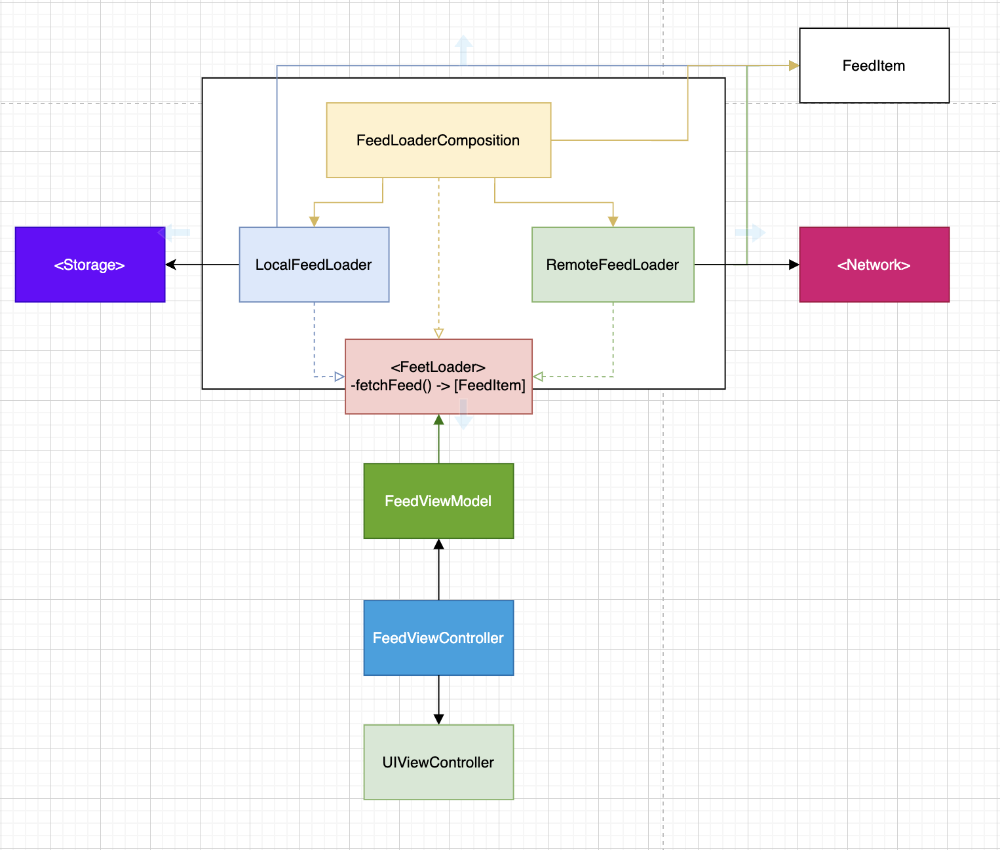

# TweetFeed

TweetFeed is Tweeter client.

## Usecases
 As a user I want to open the app and see latest feet from friends
#### Happy path:
- When I open the app, and have internet connection, app load the latest Feed from an Internet and display it.
#### Sad path:
- When I open the app, and there is no internet connection, app should load feed from Local storage and display it.
- When Internet offline and Local Storage empty then show Empty screen with Refresh button
- 
## How to run the project
> open `TweetFeed.xcproject`

> Press `Cmd + R` to run The project
> Press `Cmd + U` to run Test

### Dependency Diagram:

    

### Technical using in this project.
> BDD + TDD
- BDD: please have a look at Usecases section at begin of README.md file 
- For TDD:
The app following the Test Driven Development, you can open git graph and see the details commits history from bottom up. 
> UI architecture: MVVM
### Modular architecture:
- The app apply full `SOLID principal` design pattern to archive `Maintainable`, `Extentable`, `Testable`, enable `Parallel development` and enable `Later Binding`.
- Using Composition to combine business logic.
    -> Easy to change business logic without change many source code.
